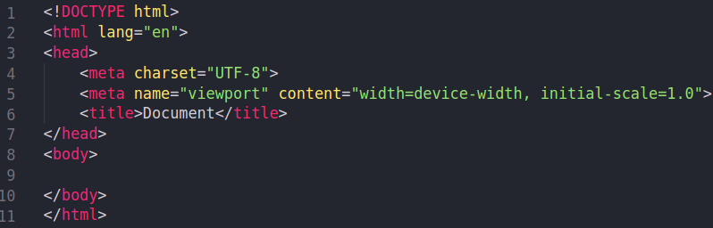

# HTML (HyperText Markup Language)

  

[Fuente: Wikipedia](https://es.wikipedia.org/wiki/HTML)

El siguiente texto esta inspirado de [MDN](https://developer.mozilla.org/es/docs/Web/JavaScript) y de [w3schools](https://www.w3schools.com/html/).

## ¿Que es HTML?
HTML viene de las siglas **HyperText Markup Language** ​ que en español
viene significando **lenguaje de marcado de hipertexto.**
Este sera nuestro estándar para la creación de sitios web.

HTML es un ​lenguaje​ que utiliza etiquetas para
representar sus elementos, como tablas, contenedores, párrafos,
etc.
estos no se verán reflejados en la página web, sin embargo estos
son necesarios porque son con lo que trabaja este marco de
hipertexto.

HTML basa su filosofía en la diferenciación. Para cada uno de los elementos que tengamos que agregar a nuestra pagina web (imágenes, videos, archivos tipo script, etc) lo haremos mediante una referencia a la ubicación de dicho archivo.
De este modo la pagina web contiene únicamente texto y es el navegador el que se encargara de unir todos estos elementos y mostrar la pagina final.

## ¿Donde encontramos HTML?

Ahora definamos lo que es **HyperText** y **Markup**.
- Hypertext:
Con este nos referimos a los enlaces que conectan las paginas web entre sí, ya sea todas las paginas que tiene un sitio web, o con paginas ajenas a este.
- Markup
El marcado de HTML contiene elementos con los cuales podremos incrustar texto, imágenes y otro tipo de contenido en nuestras paginas web.
Además de estas etiquetas tenemos otro tipo de etiquetas especiales que aprenderemos en la siguiente sección.
__Hola__

HTML al ser un estándar busca ser un lenguaje que permita que cualquier pagina web escrita con alguna versión de HTML, sea interpretada de la misma forma en cualquier otro navegador.

## Estructura básica de un HTML

  

