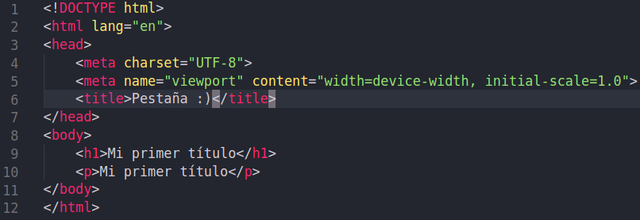
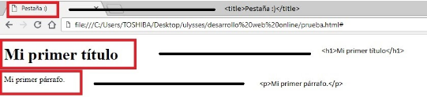

# HTML (HyperText Markup Language)

  

[Fuente: Wikipedia](https://es.wikipedia.org/wiki/HTML)

El siguiente texto esta inspirado de [MDN](https://developer.mozilla.org/es/docs/Web/JavaScript) y de [w3schools](https://www.w3schools.com/html/).

## ¿Que es HTML?
HTML viene de las siglas **HyperText Markup Language** ​ que en español
viene significando **lenguaje de marcado de hipertexto.**
Este sera nuestro estándar para la creación de sitios web.

HTML es un ​lenguaje​ que utiliza etiquetas para
representar sus elementos, como tablas, contenedores, párrafos,
etc.
estos no se verán reflejados en la página web, sin embargo estos
son necesarios porque son con lo que trabaja este marco de
hipertexto.

HTML basa su filosofía en la diferenciación. Para cada uno de los elementos que tengamos que agregar a nuestra pagina web (imágenes, videos, archivos tipo script, etc) lo haremos mediante una referencia a la ubicación de dicho archivo.
De este modo la pagina web contiene únicamente texto y es el navegador el que se encargara de unir todos estos elementos y mostrar la pagina final.

## ¿Donde encontramos HTML?

Ahora definamos lo que es **HyperText** y **Markup**.
- Hypertext:
Con este nos referimos a los enlaces que conectan las paginas web entre sí, ya sea todas las paginas que tiene un sitio web, o con paginas ajenas a este.
- Markup
El marcado de HTML contiene elementos con los cuales podremos incrustar texto, imágenes y otro tipo de contenido en nuestras paginas web.
Además de estas etiquetas tenemos otro tipo de etiquetas especiales que aprenderemos en la siguiente sección.
__Hola__

HTML al ser un estándar busca ser un lenguaje que permita que cualquier pagina web escrita con alguna versión de HTML, sea interpretada de la misma forma en cualquier otro navegador.

## Estructura básica de un HTML

  

Este es un ejemplo básico de HTML en el que se ven demasiadas cosas escritas y un tanto extrañas pero es más sencillo de lo que creen.

`<!DOCTYPE  html>` : En esta declaración le estamos especificando que versión de HTML estamos usando, que en este caso estamos usando HTML 5

`<html>` : Esta abre la etiqueta HTML la cual es la raíz de todo nuestro documento, HTML es comúnmente explicado con un árbol genealógico, porque esta etiqueta será el padre de todas las etiquetas por venir (veremos un ejemplo mas adelante)

`<head>` : En esta etiqueta agregamos meta información del documento esto quiere decir que es donde agregaremos recursos externos a nuestro documento, aquí será donde agregaremos la dirección de nuestros archivos de estilo. La etiqueta de cierre de `<head>` será de la misma forma que cerramos `<html>`
con una (/) `</head>`.

`<meta charset="utf-8">` : Este es un ejemplo de lo anteriormente explicado, en el `<head>` es el lugar donde agregamos la meta información, pero una de las formas de agregarla es con la etiqueta `<meta>`. En este ejemplo esta etiqueta `<meta>` contiene un parámetro el cual es charset (juego de caracteres)utf-8 es para agregar caracteres que no vienen en un inicio, tales como los acentos (´) o la letra ñ, explicaremos esto más adelante.
`<title>` : Esta etiqueta es bastante sencilla, lo que se agregue en esta etiqueta será el título que se mostrará en la pestaña superior del navegador como título. Para cerrar esta etiqueta usamos `</title>`. 

`<body>`: A pesar de que `<html>` es nuestra etiqueta padre, de la cual se desprenden todas, será `<body>` la que contendrá todo el contenido que será visible o que interactúa con la página web. Su cierre es `</body>`

`<h1>` : Es la etiqueta que usaremos para poner los títulos principales. Su cierre es 
`</h1>`

`
`: Es la etiqueta que usaremos para escribir los párrafos en nuestra web. Su cierre es `
`

  

Aquí podemos ver un ejemplo de lo anterior mencionado, `<html>` es el nodo principal y a partir de esta etiqueta empezaran a salir mas etiquetas, y estas serán llamados hijos de `<html>`. 

Tanto en la etiqueta de títulos principales `<h1>` y la de párrafos `
` todo lo que queramos que aparezca en la pagina tendra que ir entre su etiqueta de inicio como en la etiqueta de cierre, regresemos al ejemplo del código para poder ver con más detalle.

Si abrimos el documento que tenemos de ejemplo en el navegador nos saldrá esto.

  

