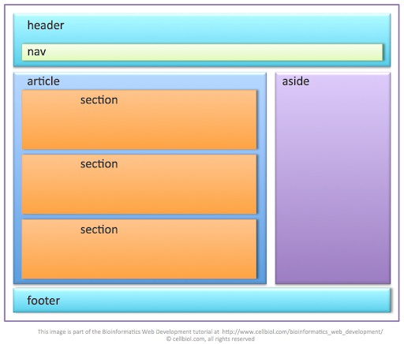
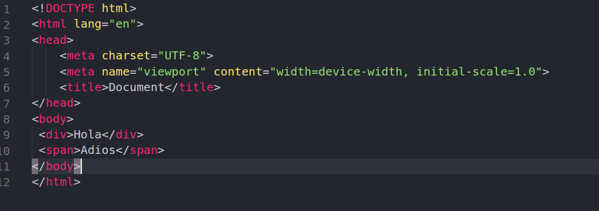
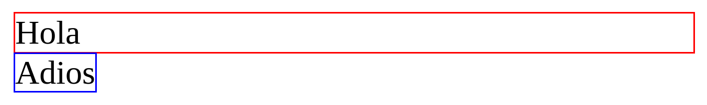
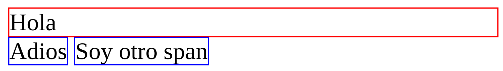

# Contenedores y elementos semanticos

    

**Paginas de referencia**

- [w3schools](https://www.w3schools.com/html/html5_semantic_elements.asp)

- [MDN](https://developer.mozilla.org/en-US/docs/Glossary/Semantics)

## Contenedores

Los contenedores son etiquetas que vamos a ocupar para poder crear divisiones en nuestras paginas, la mas comun de esta es la de nuestro elemento `
` esta etiqueta la vamos a ocupar muchisimo a lo largo de la creacion de nuestra pagina web.

### ¿Como funciona el div?

Bueno, antes que nada debemos de enteder que todas nuestras etiquetas las trataremos como una caja, este tema lo indagaremos mas cuando hablemos del model box, y de los elementos en linea y elementos en bloque.

Para explicarlo de una manera sencilla diremos que nuestra etiqueta div funcionara como un **renglon** entero, muy parecido a como trabaja nuestra etiqueta `
` explicada en el capitulo de [Etiquetas de texto](https://github.com/Code-School-Epic-Queen/Academy/blob/master/html/text.md) en la que sin importar que solo escribamos una palabra el siguiente contenido que coloquemos fuera de esta etiqueta se colocara automaticamente por debajo de este.

#### Ejemplo - div.

Vamos a usar de ejemplo el siguiente codigo, pero para una mejor apreciacion vamos a agregar un color a los limites de nuestro etiqueta `
` (rojo) y a nuestra etiqueta `` (azul)

    

Aqui podemos apreciar como es que nos quedaria el div y el span

    

Como podemos ver tenemos etiquetas que me ocuparan toda una seccion de nuestra pagina y haran que el siguiente elemento de nuestra pagina se vaya justo hacia abajo, y tendremos elementos como el span que permitiran que podamos seguir agregando elementos justo a lado de nuestro ultima etiqueta, ahora agregaremos otro span justo por debajo del primero y con esto veremos que se agregara de la siguiente manera.

    

**¿De que me sirve saber esto?**
Bueno, esto me sirve porque debemos de entender como es que funcionan las estructuras de mis etiquetas, estas dos formas seran las estructuras basicas de todas mis etiquetas HTML, todas en su estado inicial tendran una de estas dos formas de trabajar, y con estas primeras piezas seran con las que empezarmos a estructurar nuestro sitio.
En el caso de nuestra etiqueta div esta solo sera una etiqueta contenedora o de divicion, esta no se le conciderara semantica, porque esta es solo una etiqueta que va creando diviciones en la pagina, pero la etiqueta en si no me dice nada sobre el contenido de la misma, a diferencia de las que veremos mas adelante.

## Elementos semanticos

Los elementos semanticos lo que haran es describirle tanto al navegador como a los desarrolladores cual es el contenido que tendremos dentro de sus etiquetas, **estas etiquetas estan mas enfocadas en seccionar nuestro sitio web en lugar de llevar texto adentro** normalmente llevaran mas etiquetas dentro, como etiquetas de texto, listas, imagenes o hasta otras etiquetas para seguir dividiendo mas aun la pagina.
En la primer imagen que tenemos en esta pagina podemos ver como es que se suelen seccionar las paginas web, y ahi podemos ver un ejemplo de como es muy comun tener una etiqueta `<header>` y justo dentro de esta una etiqueta `<nav>` y muchas otras formas de combinar las etiquetas, enseguida explicaremos cual es el uso mas comun para cada etiqueta de segmentacion.

### Etiquetas semanticos en HTML

#### `<article>`

El elemento `<article>` especifica contenido independiente y autónomo.

Un artículo debería tener sentido por sí solo, y debería ser posible leerlo independientemente del resto del sitio web.

Ejemplos de dónde se puede usar un elemento `<article>`:

- Publicación del foro
- Entrada en el blog
- Artículo de periódico

#### `<aside>`

El elemento `<aside>` define algo de contenido aparte del contenido en el que se coloca (como una barra lateral).

El contenido `<aside>` debe estar relacionado con el contenido circundante.

#### `
`

Define detalles adicionales que el usuario puede ver u ocultar

#### `<figcaption>`

Define un título para un elemento `<figure>`

#### `<figure>`

Una imagen y una leyenda se pueden agrupar en un elemento `<figure>`.

El propósito de un subtítulo es agregar una explicación visual a una imagen.

Especifica contenido autónomo, como ilustraciones, diagramas, fotos, listados de códigos, etc.

#### `<footer>`

El elemento `<footer>` especifica un pie de página para un documento o sección.

Un elemento `<footer>` debe contener información sobre su elemento contenedor.

Un pie de página generalmente contiene el autor del documento, información de copyright, enlaces a los términos de uso, información de contacto, etc.

#### `<header>`

El elemento `<header>` especifica un encabezado para un documento o sección.

El elemento `<header>` debe usarse como contenedor para contenido introductorio.

#### `<main>`

Especifica el contenido principal de un documento.

#### `<mark>`

Define texto marcado / resaltado

#### `<nav>`

El elemento `<nav>` define un conjunto de enlaces de navegación.

Tenga en cuenta que NO todos los enlaces de un documento deben estar dentro de un elemento `<nav>`. El elemento `<nav>` está destinado solo para el bloque principal de enlaces de navegación.

#### `<section>`

El elemento `<section>` define una sección en un documento.

Según la documentación HTML del W3C: "Una sección es una agrupación temática de contenido, generalmente con un encabezado".

Una página de inicio normalmente se puede dividir en secciones para introducción, contenido e información de contacto.

#### `
`

Define un encabezado visible para un elemento `
`

#### `<time>`

Define una fecha / hora