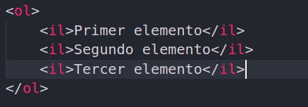
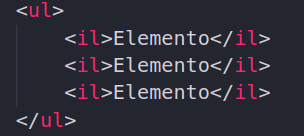

# Etiquetas de texto.

Las etiquetas de texto seran muy parecidas, cada una de estas nos van a dar un tipo de formato para el texto el cual podemos ver en diferentes aplicaciones para escritura de documentos.

Aqui veremos que se dividen en dos grupos nuestras etiquetas de texto, las que trabajan como **parrafos** y las que trabajan como **palabras** aquellas que trabajen como parrafos seran un bloque entero que se quedara en blanco y la siguiente etiqueta continuara abajo.
Las etiquetas que trabajen como palabras podremos poner una detras de la otra sin problemas.

Todas las etiquetas de texto aqui compartiran la misma estructura,
abrimos y cerramos etiquetas y en medio de estas seran donde pondremos el texto, ejemplo.

`
Aqui en medio es donde ponemos el texto
`

## Titulos (etiqueta h)
Estas etiquetas las utilizaremos para escribir nuestros titulos, siendo la etiqueta h1 el titulo mas grande hasta llegar a la etiqueta h6 que es nuestra etiqueta mas pequeña.

# Soy un titulo escrito con `<h1></h1>`
## Soy un titulo escrito con `<h2></h2>`
### Soy un titulo escrito con `<h3></h3>`
#### Soy un titulo escrito con `<h4></h4>`
##### Soy un titulo escrito con `<h5></h5>`
###### Soy un titulo escrito con `<h6></h6>`

## Parrafos (Etiqueta p)
La etiqueta `
` define un párrafo.

Los navegadores agregan automáticamente algo de espacio (margen) antes y después de cada elemento `
`. Los márgenes se pueden modificar con CSS (con las propiedades de margen).

## Enlace (etiqueta a)
La etiqueta `<a>` define un hipervínculo, que se utiliza para vincular de una página a otra.

El atributo más importante del elemento `<a>` es el atributo href, que indica el destino del enlace, aqui agregaremos la url a la que queremos dirigir nuestro enlace.
Aparte de poder poner una url tenemos 2 prefijos llamados **mailto** y **tel+** con el cual tambien podemos crear enlaces que dirijan a algun correo o numero de telefono.
Otro atributo que tenemos es el target, con el cual tendremos varias opciones de las cuales destacan: **__blank** y **__self**
siendo self su valor por default y blank la que nos permitira abrir el enlace de la pagina en una pestaña nueva.

`<a href="http://" target="_blank">Aqui va el texto de la pagina</a>`

`<a href="mailto:">Aqui va el texto visible en la pagina</a>`

`<a href="tel:+">Aqui va el texto visible en la pagina</a>`

## Bold text (b)

La etiqueta `<b>` especifica texto en negrita sin ninguna importancia adicional.

## Important text (strong)

La etiqueta `<strong>` es una etiqueta que define texto importante.

Consejo: Esta etiqueta no está en desuso, pero es posible lograr un efecto más rico con CSS.

## Italic text (i)

El contenido de la etiqueta `<i>` generalmente se muestra en cursiva.

La etiqueta `<i>` se puede usar para indicar un término técnico, una frase de otro idioma, un pensamiento o el nombre de un barco, etc.

## Emphasized text (em)

La etiqueta `<em>` es una etiqueta que presenta el texto como enfatizado.

Consejo: Esta etiqueta no está en desuso, pero es posible lograr un efecto más rico con CSS.

## Marked text (mark)

La etiqueta `<mark>` define el texto marcado.

Use la etiqueta `<mark>` si desea resaltar partes de su texto.

## small  Small text (small)

La etiqueta `<small>` define texto más pequeño (y otros comentarios secundarios).

## Deleted text (del)

La etiqueta `<del>` define el texto que se ha eliminado de un documento.

## Inserted text (ins)

La etiqueta `<ins>` define un texto que se ha insertado en un documento.

Los navegadores normalmente marcarán una línea a través del texto eliminado y subrayarán el texto insertado.

## Subscript text (sub)

La etiqueta `` define el texto del subíndice. El texto del subíndice aparece medio carácter debajo de la línea normal, y a veces se representa en una fuente más pequeña. El texto del subíndice se puede usar para fórmulas químicas, como H2O.

## Superscript text (sup)

La etiqueta `` define el texto superíndice. El texto en superíndice aparece medio carácter por encima de la línea normal, y a veces se representa en una fuente más pequeña. El texto en superíndice se puede usar para notas al pie.

# Listas

Tambien tenemos etiquetas para crear listas, podemos crear dos tipos de lista, listas ordenadas y listas desordenadas.

## ul

Las listas ordenadas seran elementos que me apareceran con un indice numerico para cada elemento. Ejemplo.

1. Primer elemento
2. Segundo elemento
3. Tercer elemento

Y las listas desordenadas seran elementos que no nos interesa que vengan con algun orden, los elementos apareceran como los fuimos escribiendo, pero el indice de estos sera un punto.

## ol

- Elemento
- Elemento
- Elemento

## il
Las etiquetas anteriores definiran como es que deben de aparecer nuestros elementos de la lista, pero para cada elemento de esta lista tenemos que agregar una etiqueta mas, y esta etiqueta es `<il>` al final para crear una lista ordenada tendriamos que poner algo asi.

    

Y para una desordenada seria asi:

    

